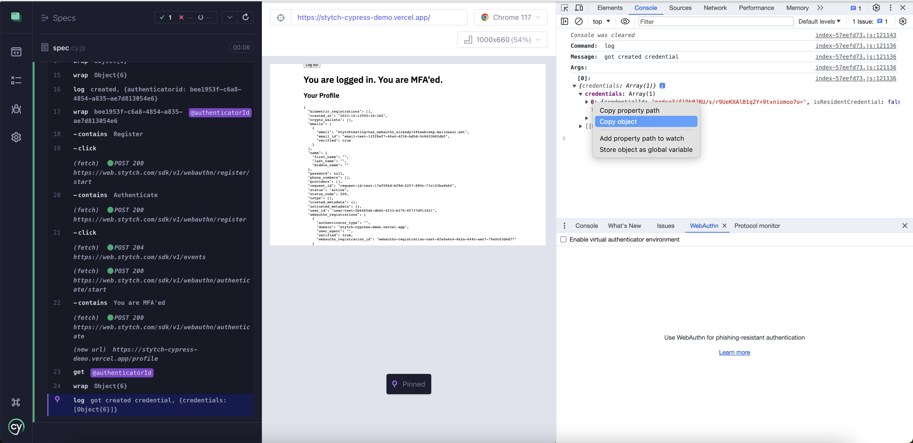

# Cypress E2E tests

Our E2E tests use Cypress and Mailosaur to test email magic links, sms otp, and WebAuthn flows on our Stytch demo app.

## Getting started

1. Create a new .env file copied from .env-template.
2. Create a new [Cypress](https://cloud.cypress.io/login) project. In your .env file, set `CYPRESS_PROJECT_ID` to your project ID.
3. Create a [Mailosaur](https://mailosaur.com/app/login) account and server. In your .env file, set `MAILOSAUR_API_KEY` and `MAILOSAUR_SERVER_ID` to be your Mailosaur server API key and and ID, respectively.
4. In Mailosaur, go to the [SMS](https://mailosaur.com/app/sms) and request a US +1 region phone number. Set your `MAILOSAUR_PHONE_NUMBER` .env variable to be this number (do not include the +1 – e.g. for the number +12345678901, `MAILOSAUR_PHONE_NUMBER=2345678901`). _**Note**: This step requires a paid Mailosaur feature. If you do not have a Mailosaur phone number, you will need to comment out the `Can log in with sms otp` test case in `spec.cy.js`._
5. By default the Cypress test will run on our hosted version of the Stytch demo app. If you would like to run the test on your local version, set the `BASE_URL` .env variable to the path of your local demo app (e.g. http://localhost:3000).
6. **Ignore this step if you use the default `BASE_URL`.** If you choose to use a different `BASE_URL`, you will also need to update `/e2e-tests/fixtures/example.json` with a different `sampleWebAuthnCredential`. To get this value, update the skipped unit test `Can sign up and save a set of WebAuthn credentials for future use` from `it.skip()` to `it.only()` and then call `yarn install && yarn cypress:open` (note that this will only work when testing on a Chrome browser). This test will output to console the WebAuthn credentials (see image below). Copy the object and replace `sampleWebAuthnCredential` object in `example.json` with this new value. Then set the unit test back to `it.skip()`.
   
7. In your terminal run:

   ```
   yarn install
   yarn run cypress:run
   ```

8. If you'd like to open the Cypress app to view the test running on the browser, run:

   ```
   yarn run cypress:open
   ```

   Note that the WebAuthn and Passkeys tests will only work when testing on a Chrome browser.
